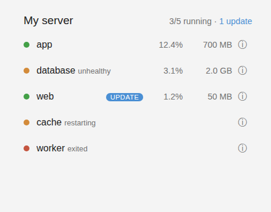

# Arcane for Home Assistant

Brings [Arcane](https://getarcane.app) into Home Assistant: every Docker environment Arcane manages, every container on it, live CPU and memory, image updates, and buttons to start, stop, restart and redeploy. It also ships an **Arcane card** for your dashboards, served by the integration itself, so there is nothing extra to install.



## What you get

**One device per Arcane environment** (a Docker host), with:

| Entity | What it shows |
| --- | --- |
| `binary_sensor.<env>_online` | Whether Arcane can reach the host |
| `sensor.<env>_running_containers` | Containers running |
| `sensor.<env>_stopped_containers` | Containers not running |
| `sensor.<env>_updates_available` | Containers with a newer image |

**One device per container**, linked to its environment, with:

| Entity | What it shows |
| --- | --- |
| `sensor.<container>_state` | running, exited, paused, restarting… (attributes: image, health, compose project, versions) |
| `sensor.<container>_cpu` | CPU % |
| `sensor.<container>_memory` | Memory in use |
| `binary_sensor.<container>_update_available` | On when Arcane has found a newer image |
| `button.<container>_start` / `_stop` / `_restart` / `_redeploy` | Run that action through Arcane |

New containers show up on their own. A redeploy gives a container a new Docker ID, but its entities are keyed on its name so they carry on.

There are also four actions, `arcane.start`, `arcane.stop`, `arcane.restart` and `arcane.redeploy`, which take any of a container's sensors as the target. The card uses these, and they are handy in automations:

```yaml
action: arcane.restart
target:
  entity_id: sensor.my_app_state
```

Requires Arcane 2.13 or newer (that's when Arcane started returning CPU and memory with the container list) and Home Assistant 2025.3 or newer.

## Install

### 1. Add it to HACS

In Home Assistant: **HACS → ⋮ (top right) → Custom repositories**

- Repository: `https://github.com/TheWarBoys2/arcane_ha`
- Type: **Integration**

Then search HACS for **Arcane**, click **Download**, and restart Home Assistant (**Settings → System → ⋮ → Restart Home Assistant**).

### 2. Make an API key in Arcane

In Arcane: **Settings → API Keys → Create**. Give it these permissions:

- `containers:list`
- `containers:start`, `containers:stop`, `containers:restart`, `containers:redeploy` (only if you want the buttons to work)

Copy the key (it starts with `arc_`). Arcane only shows it once.

### 3. Add the integration

**Settings → Devices & services → Add integration → Arcane**, then fill in:

- **Arcane URL**: the address you open Arcane on, for example `http://<arcane-ip>:3552`
- **API key**: the `arc_…` key

> Use an address Home Assistant can resolve itself. If Arcane's hostname only resolves through a VPN or a local DNS server that Home Assistant doesn't use, use the LAN IP instead.

The update interval (default 30 seconds) can be changed later under the integration's **Configure** button.

## The Arcane card

The card loads automatically once the integration is set up. To add it, edit a dashboard, click **Add card**, and pick **Arcane**. Everything is in the visual editor:

- **Environment**: which host to show
- **Sort by**: name, state, CPU or memory
- **Tapping a container**: restart it (or start it if it's stopped), show its details, or nothing
- **Ask before restarting**: on by default
- **Show stopped containers**, **Only show containers whose name contains…**, **Title**

Each row has a status dot (green running, orange restarting/paused/unhealthy, red stopped), CPU, memory, and a blue **UPDATE** badge when a newer image is waiting. The ⓘ icon opens the container's details.

Or in YAML:

```yaml
type: custom:arcane-card
environment: "0"        # Arcane's local environment is "0"
sort: cpu
tap_action: restart     # restart | more-info | none
confirm: true
show_stopped: true
# filter: plex
# exclude: [arcane, socket-proxy]
# title: My server
```

If the card doesn't appear right after installing, hard-refresh the browser (Ctrl+Shift+R) once.

## Troubleshooting

- **"Could not reach Arcane"**: from the Home Assistant host, run `curl -s http://<arcane-address>:3552/api/health`. It should answer.
- **"Arcane rejected the API key"**: the key was mistyped, expired or deleted. Home Assistant will ask for a new one if a working key stops working later.
- **CPU and memory stay at unknown**: Arcane is older than 2.13, or the environment's agent is. Update Arcane.
- **Diagnostics**: **Settings → Devices & services → Arcane → ⋮ → Download diagnostics** (the URL and key are redacted).

## Development

```bash
pip install -r requirements_test.txt
pytest
```
